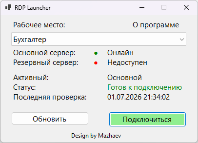

# RDP Launcher

# RDP Launcher

Простая утилита для автоматического запуска **RDP-подключений** через основной или резервный сервер.


---

## Возможности

✔ Автоматическая проверка доступности сервера по **IP:PORT**

✔ Автоматический выбор между основным и резервным каналом

✔ Поддержка нескольких RDP-профилей

✔ Не хранит логины и пароли

✔ Простая настройка через `config.ini`

✔ Портативная версия со встроенным .NET 8

---

## Как это работает

```
Старт программы
        │
        ▼
Проверка Main IP:Port
        │
   ┌────┴────┐
   │         │
Доступен   Недоступен
   │         │
   ▼         ▼
Запуск    Проверка Backup
 Main        │
             ▼
      Запуск Backup
```

---

## Конфигурация

Файл **config.ini**

```ini
[Options]
CloseAfterLaunch=True

[Servers]
MainIP=0.0.0.0
MainPort=3369

BackupIP=0.0.0.0
BackupPort=3369

[Profiles]
Бухгалтер=buh.rdp|buh_rezerv.rdp
Кассир=kassir.rdp|kassir_rezerv.rdp
Менеджер=manager.rdp|manager_rezerv.rdp
```

---

## Параметры

### CloseAfterLaunch

| Значение | Описание |
|----------|----------|
| True | Закрыть программу после запуска RDP |
| False | Оставить программу открытой |

---

## Безопасность

Программа **не хранит**:

- логины;
- пароли;
- учетные данные Windows.

В `config.ini` сохраняются только:

- IP-адреса;
- номера портов;
- список профилей.

---

## Требования

- Windows 7 / 8 / 10 / 11
- .NET 8

или используйте версию **Self-Contained**, если .NET не установлен.

---

## Лицензия

MIT License
